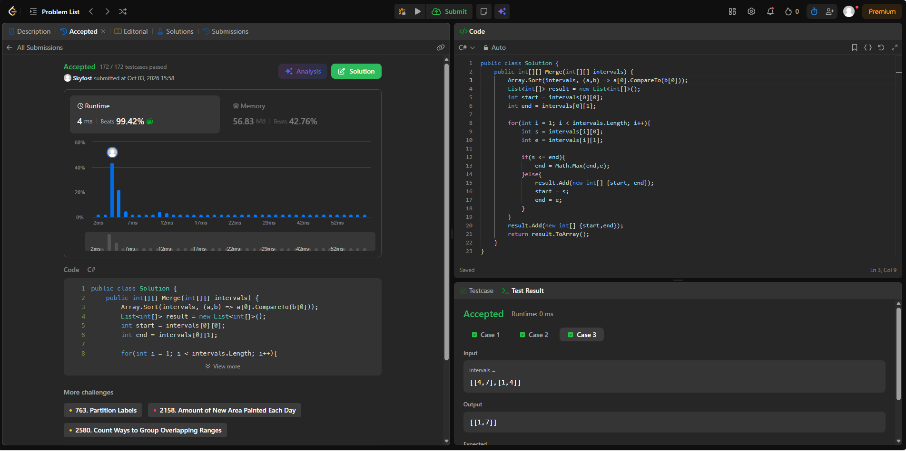
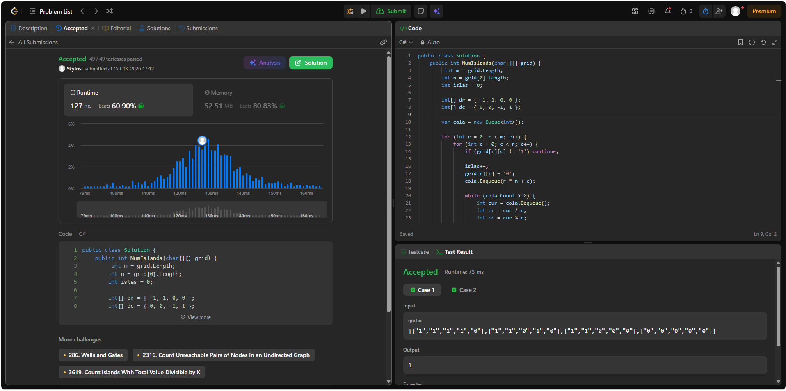

## 56. Merge Intervals
 
Enlace: https://leetcode.com/problems/merge-intervals/
Código: [`merge-intervals/Solution.cs`](merge-intervals/Solution.cs)
 
**Familia:** ordenamiento  
**Idea:** la clave es el extremo izquierdo (`start`). Se ordenan los intervalos por `start` y luego una sola pasada mantiene el intervalo «abierto» actual: si el siguiente empieza antes o justo cuando termina el actual (`start <= end`), se ensancha el `end` con el máximo; si no, se cierra el actual y se abre otro. Es el `merge` del laboratorio, pero sobre una sola corrida.  
**Complejidad:** con `n` intervalos, tiempo `O(n log n)` (domina el sort; la pasada es `O(n)`) y espacio `O(n)` para la salida (más `O(log n)` de pila del sort).
 

---

## 200. Number of Islands
 
Enlace: https://leetcode.com/problems/number-of-islands/  
Código: [`number-of-islands/Solution.cs`](number-of-islands/Solution.cs)
 
**Familia:** grafos  
**Modelo:** grafo **no dirigido** implícito en la grilla. Vértice: cada celda `'1'`. Arista: entre dos celdas `'1'` vecinas por arriba, abajo, izquierda o derecha (la diagonal no cuenta y las celdas `'0'` no son vértices). Contar islas es contar **componentes conexas**.  
**Idea:** se recorren todas las celdas; cada vez que aparece un `'1'` no visitado se suma 1 a la cuenta y se lanza un **BFS** (cola) que hunde la isla entera poniendo `'0'`, de modo que no se vuelva a contar. Se usa BFS iterativo y no DFS recursivo para evitar el desbordamiento de pila en grillas de 300 × 300.  
**Complejidad:** con `m` filas y `n` columnas, tiempo `Θ(m·n)` (cada celda se visita una vez) y espacio `O(m·n)` en el peor caso por la cola; la grilla se modifica in-place, así que no hay matriz `visited`.
 

 