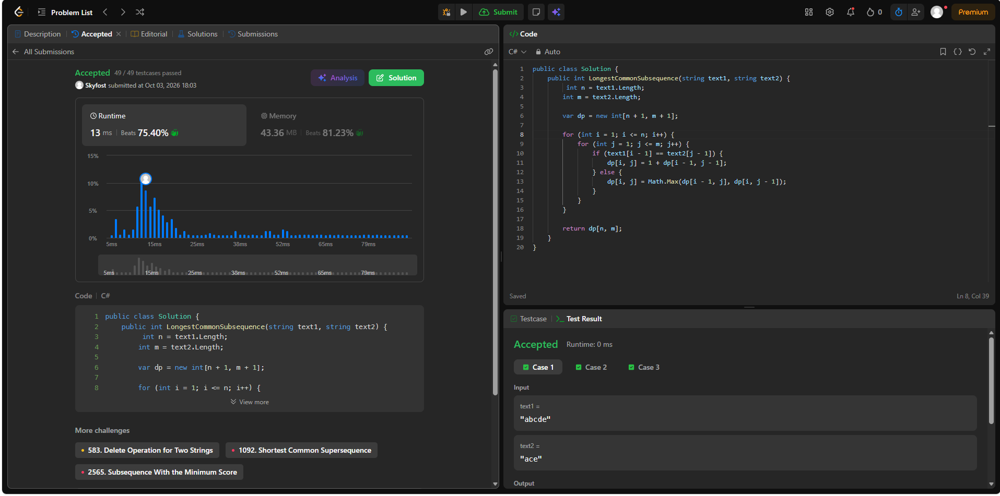
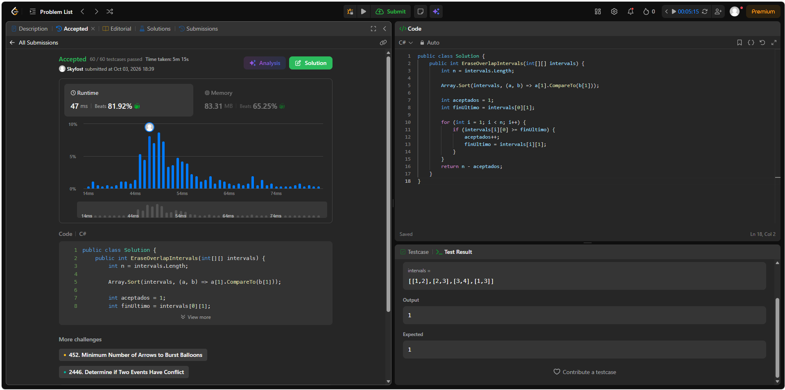

## 56. Merge Intervals
 
Enlace: https://leetcode.com/problems/merge-intervals/
Código: [`merge-intervals/Solution.cs`](merge-intervals/Solution.cs)
 
**Familia:** ordenamiento  
**Idea:** la clave es el extremo izquierdo (`start`). Se ordenan los intervalos por `start` y luego una sola pasada mantiene el intervalo «abierto» actual: si el siguiente empieza antes o justo cuando termina el actual (`start <= end`), se ensancha el `end` con el máximo; si no, se cierra el actual y se abre otro. Es el `merge` del laboratorio, pero sobre una sola corrida.  
**Complejidad:** con `n` intervalos, tiempo `O(n log n)` (domina el sort; la pasada es `O(n)`) y espacio `O(n)` para la salida (más `O(log n)` de pila del sort).
 

---

## 200. Number of Islands
 
Enlace: https://leetcode.com/problems/number-of-islands/  
Código: [`number-of-islands/Solution.cs`](number-of-islands/Solution.cs)
 
**Familia:** grafos  
**Modelo:** grafo **no dirigido** implícito en la grilla. Vértice: cada celda `'1'`. Arista: entre dos celdas `'1'` vecinas por arriba, abajo, izquierda o derecha (la diagonal no cuenta y las celdas `'0'` no son vértices). Contar islas es contar **componentes conexas**.  
**Idea:** se recorren todas las celdas; cada vez que aparece un `'1'` no visitado se suma 1 a la cuenta y se lanza un **BFS** (cola) que hunde la isla entera poniendo `'0'`, de modo que no se vuelva a contar. Se usa BFS iterativo y no DFS recursivo para evitar el desbordamiento de pila en grillas de 300 × 300.  
**Complejidad:** con `m` filas y `n` columnas, tiempo `Θ(m·n)` (cada celda se visita una vez) y espacio `O(m·n)` en el peor caso por la cola; la grilla se modifica in-place, así que no hay matriz `visited`.
 

---

## 1143. Longest Common Subsequence
 
Enlace: https://leetcode.com/problems/longest-common-subsequence/  
Código: [`longest-common-subsequence/Solution.cs`](longest-common-subsequence/Solution.cs)
 
**Familia:** programación dinámica  
**Estado:** `dp[i][j]` = longitud de la LCS de `text1[0..i)` y `text2[0..j)` (los primeros `i` caracteres de `text1` y los primeros `j` de `text2`).  
**Base:** `dp[0][j] = dp[i][0] = 0` (un prefijo vacío no comparte nada con nadie).  
**Recurrencia:** si `text1[i-1] == text2[j-1]`, entonces `dp[i][j] = 1 + dp[i-1][j-1]`; si no, `dp[i][j] = max(dp[i-1][j], dp[i][j-1])`. La respuesta es `dp[n][m]`.  
**Idea:** una subsecuencia permite borrar letras pero no reordenar, así que se mira el último carácter de cada prefijo: si coinciden, extienden la LCS de los prefijos menores; si no, uno de los dos no participa y se toma la mejor de las dos opciones. Cada celda depende solo de arriba, izquierda y diagonal, por eso se llena por filas. Un greedy de «tomar la primera coincidencia» falla, y la recursión sin memo es exponencial.  
**Complejidad:** con `n = text1.length` y `m = text2.length`, tiempo `Θ(n·m)` y espacio `Θ(n·m)` por la tabla (bajaría a `Θ(min(n, m))` guardando solo dos filas).
 

---

## 435. Non-overlapping Intervals
 
Enlace: https://leetcode.com/problems/non-overlapping-intervals/  
Código: [`non-overlapping-intervals/Solution.cs`](non-overlapping-intervals/Solution.cs)
 
**Familia:** greedy  
**Criterio greedy:** se ordenan los intervalos por extremo derecho (`end`) y, entre los que aún caben, se elige siempre el que **termina antes**; el siguiente aceptado es el primero cuyo `start` es mayor o igual al `end` del último aceptado. Lo que no se acepta es lo que se «borra».  
**Idea:** es la selección de actividades de la guía contada al revés: maximizar cuántos intervalos caben sin solape equivale a minimizar cuántos se tiran, así que la respuesta es `n − aceptados`. Terminar pronto deja el mayor espacio libre para los siguientes; por intercambio, cualquier solución óptima puede sustituir su primer intervalo por el que termina antes sin crear solapes. Dos intervalos se solapan si uno empieza antes de que el otro termine; si `start == end` del último, no se solapan.  
**Complejidad:** con `n` intervalos, tiempo `O(n log n)` (domina el sort; la pasada es `O(n)`) y espacio `O(1)` extra, porque el sort es in-place (más `O(log n)` de pila del sort).
 
